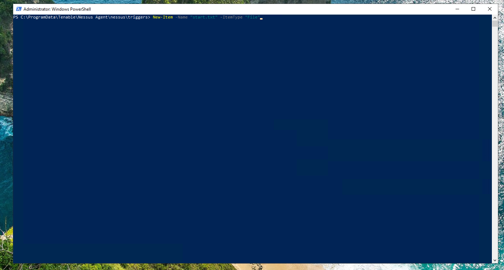

# Agent Based Vulnerability Scanning

 

## Purpose

I will use Microsoft Azure to create virtual machines and perform an agent-based scan on a Windows and Linux device using Tenable Nessus. This lab demonstrates a real-world scenario where scanning can be done remotely on a scheduled basis or triggered by a file being present. In this case, I will do a trigger-based scan where a scan will initiate when the specified file is detected in the Nessus Trigger file path. 

## Procedure

`Windows`

Create Windows Virtual Machine

 

Using Tenable Nessus, Create Agent Group

 

Create a **Basic Agent Scan** using the Nessus Agent scan template

 

Add the agent group created earlier

 

Select triggered scan, set to file name, add name of desired file to trigger scan, and save. In this case, I use **start.txt**

 

Go back to **Agent Groups** and select **Add Nessus Agent** to copy the Windows command to install the agent

Copy the command:

`Invoke-WebRequest -Uri "https://sensor.cloud.tenable.com/install/agent/installer/ms-install-script.ps1" -OutFile "./ms-install-script.ps1"; & "./ms-install-script.ps1" -key "58aab372289ac80911e4c5ad40a07b23b5524319f9ff5c010aa50ec625ccf389" -type "agent" -name "<agent name>" -groups '<list of groups>'; Remove-Item -Path "./ms-install-script.ps1"`

and edit as necessary before executing in powershell as administrator to install the agent on the Windows machine

 

Remote Desktop into created Windows virtual machine and run command to install agent

 

 

Wait for agent connection to link, then navigate to agent trigger file path and create file `start.txt`

 

  

 

Wait for the scanning agent to detect file. You can `ls` to see the file in the directory. When you no longer see the file, the agent has detected the file and the scan will be triggered. Analyze and remediate scan results as usual.

 

 

`Linux`

## Discussion

This lab has taught me that in a real-life scenario, it's not feasible to have direct access to a machine in a large enterprise environment where you can disable the firewall and enable ICMPv4 or need an IP address in order to have a successful vulnerability scan. Instead, you can install the scanning agent on the machine, specify a scan condition (scheduled vs triggered), and have an authenticated scan performed when that condition is met. The scan is authenticated because the agent is already installed on the system. So for continuous vulnerability management, multiple devices could be added to an agent group and they could all be scanned on a scheduled basis -- weekly or monthly for example.   

## Planned Improvements

`add multiple devices to an agent group and have them all satisfy the same scan condition` 
